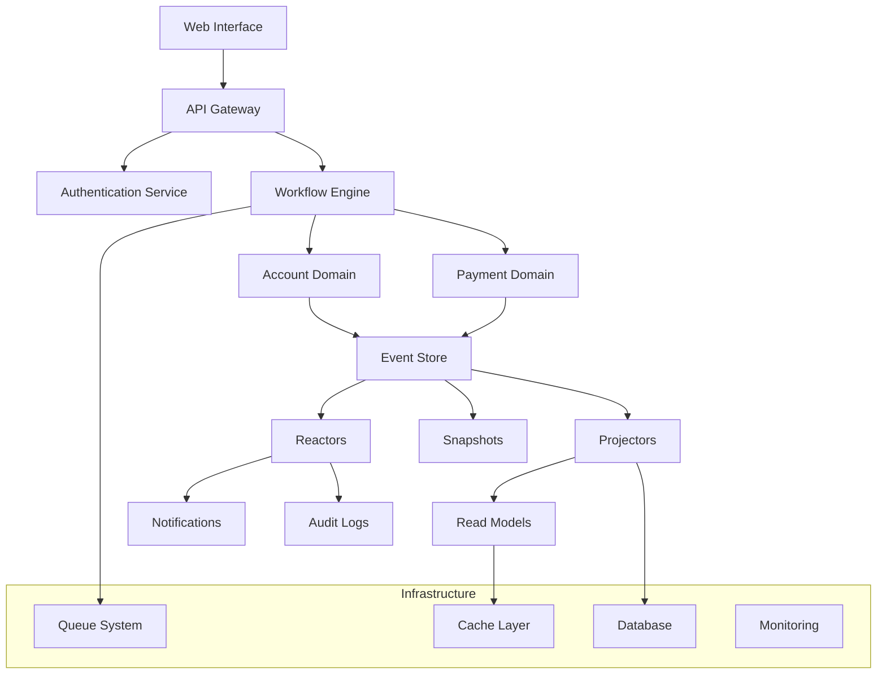
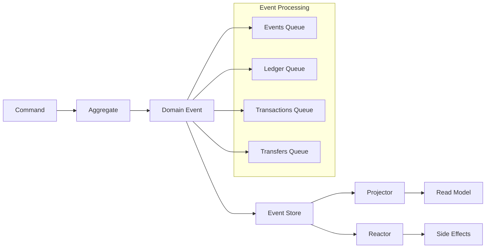
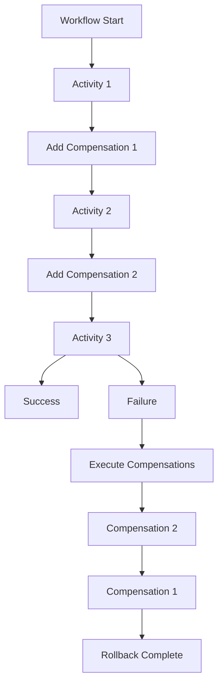

# FinAegis Core Banking Platform - System Architecture

## Overview

FinAegis is designed as a modern, scalable core banking platform using event sourcing, domain-driven design, and microservices-ready architecture principles. The system is built to handle high-volume financial transactions with strong consistency, auditability, and regulatory compliance.

## High-Level Architecture



## Core Components

### 1. Domain Layer

#### Account Domain (`app/Domain/Account/`)

**Aggregates:**
- `LedgerAggregate`: Account lifecycle management
- `TransactionAggregate`: Money movements and balance tracking
- `TransferAggregate`: Inter-account transfers

**Events:**
- Account Events: `AccountCreated`, `AccountDeleted`, `AccountFrozen`, `AccountUnfrozen`
- Transaction Events: `MoneyAdded`, `MoneySubtracted`, `MoneyTransferred`
- Threshold Events: `TransactionThresholdReached`, `TransferThresholdReached`

**Value Objects:**
- `Account`: Account data structure
- `Money`: Monetary amounts with validation
- `Hash`: Quantum-resistant cryptographic hashes
- `AccountUuid`: Strongly typed UUIDs

#### Payment Domain (`app/Domain/Payment/`)

**Services:**
- `TransferService`: Orchestrates money transfers

**Workflows:**
- `TransferWorkflow`: Handles transfer operations with compensation

### 2. Event Sourcing Layer



**Event Store Configuration:**
```php
// config/event-sourcing.php
'event_class_map' => [
    'account_created' => AccountCreated::class,
    'money_added' => MoneyAdded::class,
    'money_subtracted' => MoneySubtracted::class,
    'money_transferred' => MoneyTransferred::class,
    // ... more events
],

'queue' => env('EVENT_PROJECTOR_QUEUE_NAME', 'events'),
'catch_exceptions' => env('EVENT_PROJECTOR_CATCH_EXCEPTIONS', false),
```

**Projectors:**
- `AccountProjector`: Maintains current account state
- `TurnoverProjector`: Calculates daily/periodic turnovers

**Reactors:**
- `SnapshotTransactionsReactor`: Creates snapshots at transaction thresholds
- `SnapshotTransfersReactor`: Creates snapshots at transfer thresholds

### 3. Workflow Engine

The platform uses a saga pattern implementation for complex business processes:



**Workflow Categories:**

1. **Account Management Workflows:**
   - `CreateAccountWorkflow` → `CreateAccountActivity`
   - `DestroyAccountWorkflow` → `DestroyAccountActivity`
   - `FreezeAccountWorkflow` → `FreezeAccountActivity`
   - `UnfreezeAccountWorkflow` → `UnfreezeAccountActivity`

2. **Transaction Workflows:**
   - `DepositAccountWorkflow` → `DepositAccountActivity`
   - `WithdrawAccountWorkflow` → `WithdrawAccountActivity`
   - `TransactionReversalWorkflow` → `TransactionReversalActivity`

3. **Transfer Workflows:**
   - `TransferWorkflow` (with compensation)
   - `BulkTransferWorkflow` (with compensation)

4. **System Workflows:**
   - `BalanceInquiryWorkflow` → `BalanceInquiryActivity`
   - `AccountValidationWorkflow` → `AccountValidationActivity`
   - `BatchProcessingWorkflow` → `BatchProcessingActivity`

### 4. Security Architecture

#### Quantum-Resistant Hashing

```php
trait ValidatesHash
{
    private const string HASH_ALGORITHM = 'sha3-512';
    private const int HASH_LENGTH = 128;
    
    protected function generateHash(?Money $money = null): Hash
    {
        return new Hash(hash(
            self::HASH_ALGORITHM,
            $this->currentHash . ($money ? $money->getAmount() : 0)
        ));
    }
}
```

#### Event Integrity

All financial events include cryptographic hashes:

```php
class MoneyAdded extends ShouldBeStored implements HasHash, HasMoney
{
    public function __construct(
        public readonly Money $money,
        public readonly Hash $hash
    ) {}
}
```

#### Authentication & Authorization

- Laravel Sanctum for API authentication
- Laravel Passport for OAuth2 (optional)
- Role-based access control with Spatie Permissions
- Multi-factor authentication via Laravel Fortify

### 5. Data Architecture

#### Event Store Schema

```sql
-- Stored Events
CREATE TABLE stored_events (
    id BIGINT UNSIGNED AUTO_INCREMENT PRIMARY KEY,
    aggregate_uuid VARCHAR(36) NOT NULL,
    aggregate_version INT NOT NULL,
    event_version INT NOT NULL,
    event_class VARCHAR(255) NOT NULL,
    event_properties JSON NOT NULL,
    meta_data JSON,
    created_at TIMESTAMP,
    
    INDEX idx_aggregate_uuid (aggregate_uuid),
    INDEX idx_event_class (event_class),
    UNIQUE KEY unique_aggregate_version (aggregate_uuid, aggregate_version)
);

-- Snapshots
CREATE TABLE snapshots (
    id BIGINT UNSIGNED AUTO_INCREMENT PRIMARY KEY,
    aggregate_uuid VARCHAR(36) NOT NULL,
    aggregate_version INT NOT NULL,
    state JSON NOT NULL,
    created_at TIMESTAMP,
    
    INDEX idx_aggregate_uuid (aggregate_uuid),
    UNIQUE KEY unique_aggregate_snapshot (aggregate_uuid, aggregate_version)
);
```

#### Read Models

```sql
-- Accounts (Read Model)
CREATE TABLE accounts (
    id BIGINT UNSIGNED AUTO_INCREMENT PRIMARY KEY,
    uuid VARCHAR(36) UNIQUE NOT NULL,
    name VARCHAR(255) NOT NULL,
    user_uuid VARCHAR(36) NOT NULL,
    balance DECIMAL(15,2) DEFAULT 0,
    status ENUM('active', 'frozen', 'closed') DEFAULT 'active',
    created_at TIMESTAMP,
    updated_at TIMESTAMP,
    
    INDEX idx_user_uuid (user_uuid),
    INDEX idx_status (status)
);

-- Transactions (Read Model)
CREATE TABLE transactions (
    id BIGINT UNSIGNED AUTO_INCREMENT PRIMARY KEY,
    uuid VARCHAR(36) UNIQUE NOT NULL,
    account_uuid VARCHAR(36) NOT NULL,
    type ENUM('credit', 'debit') NOT NULL,
    amount DECIMAL(15,2) NOT NULL,
    hash VARCHAR(128) NOT NULL,
    created_at TIMESTAMP,
    
    INDEX idx_account_uuid (account_uuid),
    INDEX idx_type (type),
    INDEX idx_created_at (created_at)
);

-- Turnovers (Read Model)
CREATE TABLE turnovers (
    id BIGINT UNSIGNED AUTO_INCREMENT PRIMARY KEY,
    account_uuid VARCHAR(36) NOT NULL,
    date DATE NOT NULL,
    credit_amount DECIMAL(15,2) DEFAULT 0,
    debit_amount DECIMAL(15,2) DEFAULT 0,
    net_amount DECIMAL(15,2) DEFAULT 0,
    created_at TIMESTAMP,
    updated_at TIMESTAMP,
    
    UNIQUE KEY unique_account_date (account_uuid, date),
    INDEX idx_date (date)
);
```

### 6. Queue Architecture

The system uses separate queues for different types of processing:

```php
enum EventQueues: string {
    case EVENTS = 'events';        // General events
    case LEDGER = 'ledger';        // Account lifecycle events
    case TRANSACTIONS = 'transactions'; // Money movement events
    case TRANSFERS = 'transfers';  // Transfer-specific events
}
```

**Queue Configuration:**
```php
// config/queue.php
'connections' => [
    'redis' => [
        'driver' => 'redis',
        'connection' => 'default',
        'queue' => env('REDIS_QUEUE', 'default'),
        'retry_after' => 90,
        'block_for' => null,
    ],
],
```

### 7. Scalability Considerations

#### Horizontal Scaling

1. **Read Model Separation**: Read models can be scaled independently
2. **Queue Scaling**: Different event types processed by separate workers
3. **Database Sharding**: Event store can be sharded by aggregate UUID
4. **Caching Strategy**: Redis for read model caching

#### Event Store Optimization

1. **Snapshot Strategy**: Automatic snapshots at configurable thresholds
2. **Event Archival**: Old events moved to cold storage
3. **Query Optimization**: Proper indexing on aggregate UUID and version

#### Performance Monitoring

```php
// config/telescope.php for development
// config/pulse.php for production monitoring
```

### 8. Deployment Architecture

#### Docker Configuration

```yaml
services:
  app:
    build: .
    ports:
      - "8000:80"
    environment:
      - APP_ENV=production
      - DB_CONNECTION=mysql
      - REDIS_HOST=redis
      - QUEUE_CONNECTION=redis
    
  mysql:
    image: mysql:8.0
    environment:
      MYSQL_DATABASE: finaegis
      MYSQL_ROOT_PASSWORD: secret
    
  redis:
    image: redis:7-alpine
    
  queue:
    build: .
    command: php artisan queue:work --queue=events,ledger,transactions,transfers
    depends_on:
      - mysql
      - redis
```

#### Production Considerations

1. **Load Balancing**: Multiple application instances behind a load balancer
2. **Database Clustering**: Master-slave MySQL setup for read/write separation
3. **Redis Clustering**: For high-availability caching and queues
4. **Monitoring**: Prometheus + Grafana for metrics, ELK stack for logs

### 9. Integration Points

#### External Systems

1. **Payment Gateways**: Stripe, PayPal integration points
2. **Regulatory Reporting**: Export APIs for compliance reports
3. **KYC/AML Services**: Integration with identity verification services
4. **Core Banking Legacy**: APIs for legacy system integration

#### API Design

```php
// RESTful API endpoints
POST   /api/accounts              # Create account
GET    /api/accounts/{uuid}       # Get account details
POST   /api/accounts/{uuid}/deposit    # Deposit money
POST   /api/accounts/{uuid}/withdraw   # Withdraw money
POST   /api/transfers              # Create transfer
GET    /api/accounts/{uuid}/balance    # Balance inquiry
POST   /api/accounts/{uuid}/freeze     # Freeze account
```

## Security Considerations

### 1. Data Protection

- **Encryption at Rest**: Database encryption for sensitive data
- **Encryption in Transit**: TLS 1.3 for all API communications
- **Event Signing**: Cryptographic signatures on all events
- **Hash Chains**: Quantum-resistant hash chains for transaction integrity

### 2. Access Control

- **Multi-Factor Authentication**: Required for administrative operations
- **Role-Based Permissions**: Granular permissions for different user types
- **API Rate Limiting**: Protection against abuse
- **Audit Logging**: Complete audit trail for all operations

### 3. Compliance

- **GDPR**: Data anonymization and deletion capabilities
- **PCI DSS**: Secure handling of payment card data
- **SOX**: Financial reporting controls
- **Basel III**: Risk management and capital adequacy

## Monitoring and Observability

### 1. Application Monitoring

- **Laravel Telescope**: Development debugging
- **Laravel Pulse**: Production performance monitoring
- **Custom Metrics**: Business metrics collection

### 2. Infrastructure Monitoring

- **System Metrics**: CPU, memory, disk usage
- **Database Monitoring**: Query performance, connection pooling
- **Queue Monitoring**: Job processing rates, failure rates

### 3. Business Intelligence

- **Event Analytics**: Real-time analysis of business events
- **Financial Reporting**: Automated report generation
- **Compliance Dashboards**: Regulatory compliance monitoring

This architecture provides a solid foundation for a modern core banking platform with the flexibility to scale and adapt to changing business requirements while maintaining the highest standards of security and compliance.